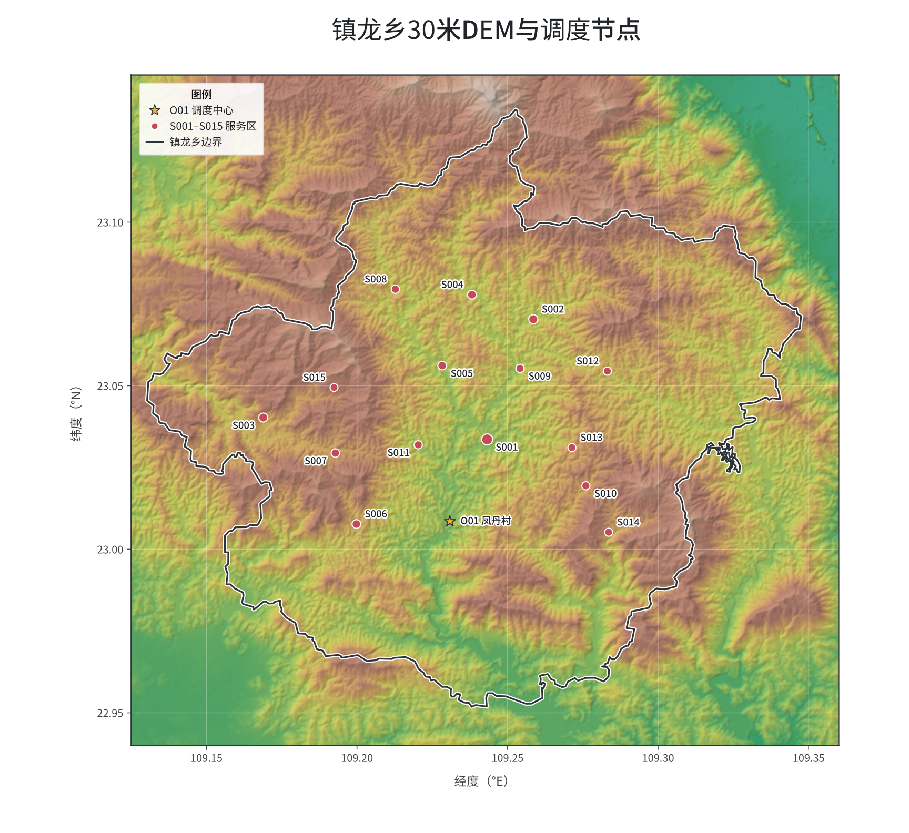

# D题：山区洪涝灾害下无人机运输与通信协同优化 —— 提交材料总览

本题为第二十三届中国研究生数学建模竞赛 D 题。镇龙乡山区洪涝灾害后道路损毁，
需使用无人机在时限内将 80 箱应急物资从调度中心 O01 运送至 15 个服务区，同时
运输无人机在整个飞行过程中须与调度中心保持通信（直连或经悬停中继的双跳）。
问题依次要求：单点组批（问题一）、多机均衡运输调度（问题二）、运输与中继
通信的联合调度（问题三）、分区资源配置（问题四）。

## 问题描述示意图

> 图 1（题目原文）：30 m DEM 与调度节点整体位置关系。下方为矢量原图链接。



- 矢量版本：[问题描述图.svg](问题描述图片/问题描述图.svg)（可放大查看细节）

图片提取自 `山区洪涝灾害下无人机运输与通信协同优化.docx`（题目原文附图），
DEM 数据与调度节点、服务区、中继候选点的相对位置关系见 `数据/镇龙乡地理空间数据`。

## 目录结构

```
D题/
├── 论文-山区洪涝无人机D题.pdf      论文排版成品（28 页，LaTeX 编译）
├── 山区洪涝灾害下无人机运输与通信协同优化.docx   题目原文
├── 结果提交模板.xlsx               官方提交模板（空白）
├── 结果提交模板_填写.xlsx          已填写的最终结果（Q1–Q4 六个工作表）
├── main.tex + sections/           论文 LaTeX 源码（问题一至问题四分章节）
├── figures/                        论文插图（问题三甘特图/中继时间线/通信时间线等）
├── 数据/                           题目配套数据（基础数据 + 地理空间/DEM）
├── 问题描述图片/                   题目原文图 1（PNG + SVG）
└── 求解代码与结果/                 确定性求解程序副本 + 最终结果 JSON + README
```

## 各问题结论速览

| 问题 | 结论 |
|---|---|
| 问题一 | 单点组批 18 班次，C 型机承担重载区，A 型承担轻载区 |
| 问题二 | 24 架次均衡运输，makespan 8342.1 s，能耗 77.31 kWh，时限零违反 |
| 问题三 | 24 架次 + 两架中继三时段，makespan 8356.3 s，能耗 74.95 kWh，38 个中继任务段全覆盖、盲区为零 |
| 问题四 | K=3 分区（西/北 10 区、东 4 区、S004 独立组）及 K=2 对照的资源分配 |

详细方案、货箱重排清单、架次明细与中继时序见论文第三/四节，数据文件见
`求解代码与结果/结果/`，复现方法见 [`求解代码与结果/README.md`](求解代码与结果/README.md)。

## 快速复现

所有程序在原始工作区 `华为杯latex模板/` 下运行（数据为相对路径，指向本目录
`数据/`）：

```bash
# 复现问题三最终方案并生成 p3_final.json
python -X utf8 solve_d/versions/v9w_q3_final.py

# 独立实证校验（重算调度、核对时限/资源/货箱）
python -X utf8 solve_d/versions/verify_result.py check_p3

# 填写《结果提交模板.xlsx》
python -X utf8 solve_d/code/export_excel.py

# 重绘论文图件（甘特图、中继时间线、通信保障时间线等）
python -X utf8 solve_d/code/p3_figures.py
python -X utf8 -c "import advanced_figures as af; af.fig3_relay_tl(); af.fig3_comm_tl()"
```

> 注：核心物理模块 `求解代码与结果/代码/core.py` 已改为**可移植数据路径**（自动回退到
> 仓库内 `数据/`），上述命令可在本目录直接运行，不再依赖原始模板目录。

## 算法进化实验台账（v0 → v2）

在 `求解代码与结果/实验/` 下对**问题二**建立了多算法家族横向对比基准（墙钟预算，公平
对比 SA / GA / ALNS / Tabu / GRASP 五种元启发式），每次实验写入 `samples/bench_p2_results.json`
与 `samples/bench_p2_report.md`，关键版本均以 git commit 存档：

| 版本 | 提交 | 内容与结果 |
|---|---|---|
| v0 | f5e9429 | 修复 core.py 数据路径可移植性（原硬编码模板目录） |
| v1 | 26f04fc | 实验框架 + 五大家族求解器；Tabu 首胜论文基线 |
| v2 | 4c786ed | 60s×3 种子全量对比 → 冠军 **Tabu**：21 架次、makespan **8337.0 s**、能耗 **68.06 kWh**、零迟到、硬约束全过（论文基线 24 架次 / 8342.1 s / 77.31 kWh，能耗降 ~12%） |

复现冠军方案并输入问题三联合调度管线：

```bash
python -X utf8 求解代码与结果/实验/benchmark.py --seconds 60 --seeds 7,11,13
python -X utf8 求解代码与结果/实验/export_p2.py --solver tabu --seconds 120
python -X utf8 求解代码与结果/代码/p3_co2.py   # 读取 p2_results.json 做运输-中继联合调度
```